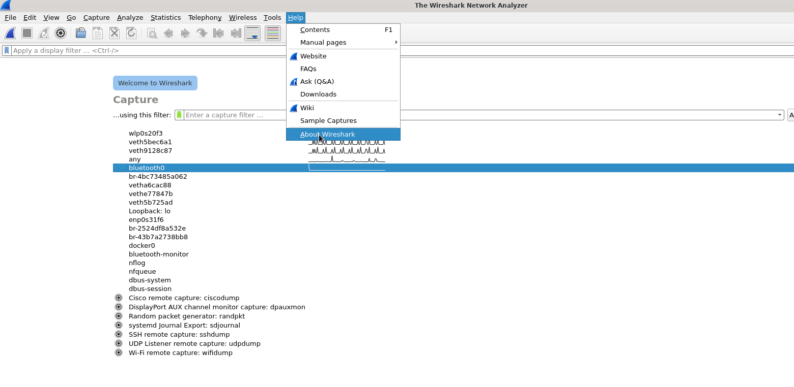
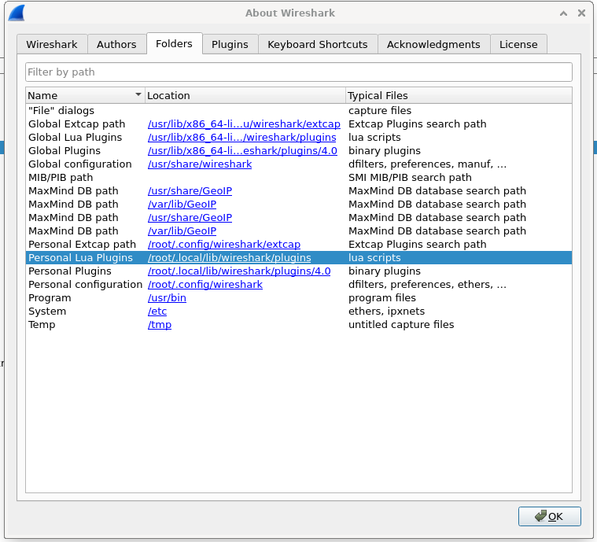

# LURK Dissector

This is a protocol dissector for Wireshark captures to support the [LURK protocol](http://isoptera.lcsc.edu/~seth/cs435/lurk_2.3.html). The dissector will decode application layer bytes on top of TCP.

## Installation

In Wireshark, open the "About Wireshark" dialog box:

Then, navigate to "folders" and find the plugin directory under "Personal Lua Plugins":

You can double click the directory to open it in a file manager where you can place the `.lua` file.

## Fields

- `Message Type`
    - Displays in text what type of message is being sent by decoding the first byte. This field exists in all LURK messages.

### Message

- `Recipient`
- `Sender`
- `Narration`
    - Either a "Yes" or "No" string
- `Message`

### Accept

- `Accepted Action`
    - Will be a `Message Type` value indicating which type was accepted.

TBD...

