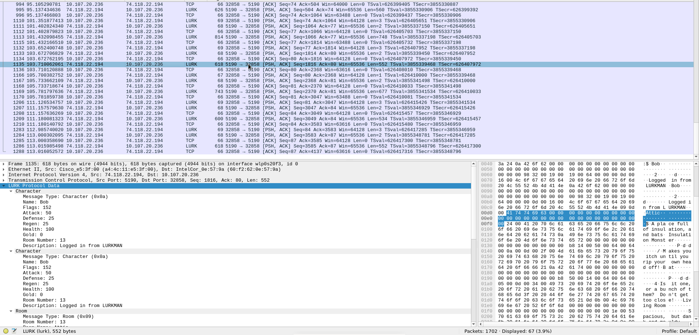

# LURK Dissector

This is a protocol dissector for Wireshark captures to support the [LURK protocol](http://isoptera.lcsc.edu/~seth/cs435/lurk_2.3.html). The dissector will decode application layer bytes on top of TCP.

## Installation

In Wireshark, open the "About Wireshark" dialog box:

Then, navigate to "Folders" and find the plugin directory under "Personal Lua Plugins":

You can double click the directory to open it in a file manager where you can place the `.lua` file.

## Fields

A list of all supported fields. Each field includes `Message Type`, so any messages where their only content is a `Message Type` will display as such:

- `Message Type`
    - Displays in text what type of message is being sent by decoding the first byte.

The rest of the messages will include the `Message Type` field along with their specific fields.

### Message

- `Recipient`
- `Sender`
- `Narration`
    - Either a "Yes" or "No" string
- `Message`

### Change Room

- `Room Number`

### PVP Fight

- `Target`
    - String name of the target

### Loot

- `Target`
    - String name of the target

### Error

- `Error Code`
    - The error code followed by the description associated with the code
- `Error Message`

### Accept

- `Accepted Action`
    - Will be a `Message Type` value indicating which type was accepted.

### Room

- `Room Number`
- `Room Name`
- `Room Description`

### Character

- `Name`
- `Flags`
    - Shown as a decimal number. Will display as booleans in a future release.
- `Attack`
- `Defense`
- `Regen`
- `Health`
- `Gold`
- `Room Number`
- `Description`

### Game

- `Initial Points`
- `Stat Limit`
- `Game Description`

### Version

- `Major Revision`
- `Minor Revision`
- `Bytes of Extensions`

Any other extension data won't be displayed in a field, just as a payload.

## Example

